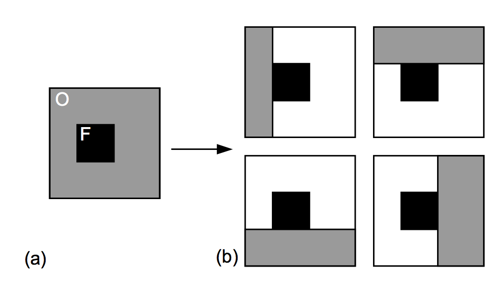

[  ](https://bintray.com/arasthel/maven/spannedgridlayoutmanager/_latestVersion) [](https://android-arsenal.com/api?level=14) [](https://opensource.org/licenses/MIT)

# SpannedGridLayoutManager

**SpannedGridLayouManager** is a layout manager that will resize and reorder views based on a provided `SpanSize`.

**IMPORTANT**: as the goal of this LayoutManager is to fill all gaps if possible, views may be placed in an order which may not be related to their positions. That is, if `View #9` can fill a gap before `View #8`, it will be placed in an previous position, ignoring the normal ordering.


## Usage

Gradle dependency:

```groovy
dependencies {
	implementation 'com.arasthel:spannedgridlayoutmanager:2.0.4'
}
```

When you create a new `SpannedGridLayoutManager` you must provide:

* An `Orientation`: `Orientation.VERTICAL` or `Orientation.HORIZONTAL`.
* The **span count** to divide the layout.

**Kotlin** Example:

```kotlin
val spannedGridLayoutManager = SpannedGridLayoutManager(
                orientation = SpannedGridLayoutManager.Orientation.VERTICAL, 
                spans = 4)
recyclerview.layoutManager = spannedGridLayoutManager
```

**Java** Example:

```java
SpannedGridLayoutManager spannedGridLayoutManager = new SpannedGridLayoutManager(
			SpannedGridLayoutManager.Orientation.VERTICAL, 4);
recyclerview.setLayoutManager(spannedGridLayoutManager);
```


To set the `SpanSize` for each view, you would do it on the `RecyclerView.Adapter`. I would do it in `onBindViewHolder` method, since you have access to `position` and can use several sizes depending on the position or your model's data.

**Kotlin:**

```kotlin
override fun onBindViewHolder(holder: ViewHolder, position: Int) {
    val width = 1
    val height = 2

    holder.itemView.layoutParams = SpanLayoutParams(SpanSize(width, height))
}
```
**Java:**

```java
@Override
public void onBindViewHolder(ViewHolder holder, int position) {
    int width = 1;
    int height = 2;

    holder.itemView.setLayoutParams(new SpanLayoutParams(new SpanSize(width, height)));
}
```

### Known issue: the LayoutManager may hang the UI thread when it's recreated

Why does this happen? To restore the *X* scroll position, all views before *X* must be measured and layouted to calculate the scroll offset for the *X* view. This is done by asking the `RecyclerView` to provide the ViewHolders of the items to get their `SpanLayoutParams.spanSize`, which calls both `RecyclerViewAdapter.createViewHolder` and `RecyclerViewAdapter.bindViewHolder`. 

If too much work is done in the `onBindVIewHolder` method, this calculation will become slow and hang the main thread. However, there's a workaround for this behavior:

1. Limit your `onBindViewHolder` method to setting the *spanSize* property if needed, or leave it empty. Example:

```kotlin
 override fun onBindViewHolder(holder: GridItemViewHolder, position: Int) {
         val width = if (clickedItems[position]) 2 else 1
         val height = if (clickedItems[position]) 2 else 1
 
         val spanSize = SpanSize(width, height)
         holder.itemView.layoutParams = SpanLayoutParams(spanSize)
     }
 ```
 
 2. Move all the code that would actually configure and style your items to `RecyclerView.onViewAttachedToWindow`. Example:
 
 ```kotlin
 override fun onViewAttachedToWindow(holder: GridItemViewHolder) {
         super.onViewAttachedToWindow(holder)
 
         val position = holder.adapterPosition
 
         (holder.itemView as? GridItemView)?.setTitle("$position")
 
         holder.itemView.setBackgroundColor(
                 colors[position % colors.size]
         )
 
         holder.itemView.setOnClickListener {
             clickedItems[position] = !clickedItems[position]
             notifyItemChanged(position)
         }
     }
 ```
 
 This way, the items won't be configured until you actually need them and the layouting process will be fast again.
 
### About restoring scroll position:

As this *LayoutManager* may change the order in screen of its items, it has some issues with restoring scroll position when the sizes of the items change drastically. To work around this, restoring the scroll position when recreating this *LayoutManager* is disabled by default.

If you are **sure** that the position of the items won't change much, you can enable it again using:

```kotlin
spannedLayoutManager.itemOrderIsStable = true
```

## Migrating from 1.X to 2.X

Due to critical layout issues, the API for using SpanSizes had to change. The only changes you should have to do in your code are:

```kotlin
    val width = 1
    val height = 2

    // OLD
    // holder.itemView.layoutParams = RecyclerView.LayoutParams(width, height)

    // NEW
    holder.itemView.layoutParams = SpanLayoutParams(SpanSize(width, height))
```

Just use the new `SpanLayoutParams` instead of generic `RecyclerView.LayoutParams`.

## Animations

To have animations as shown in the sample, you must:

* Use `setHasStableIds(true)` in your adapter.
* Override `getItemId` method to return a stable id - that is, it won't change for the same position.
* Use `adapter.notifyDatasetChanged()` to trigger the layout process.

## Implementation details

This library uses `Rects` to find the empty gaps and choose where a view will be placed. The underlying algorithm is explained in [this paper](free_space_algorithm.pdf).

* Initially, there will be **1** free-space **Rect** `(0, 0, spanCount, Int.MAX_VALUE)` for `Orientation.VERTICAL` or `(0, 0, Int.MAX_VALUE, spanCount)` for `Orientation.HORIZONTAL`. 
* When a view must added, it will search for the free rects that are **adjacent** to the view's `Rect` or that intersects it.
* It will iterate over these rects looking for those that are adjacent to the view **and don't contain it**, which will be stored. If a rect doesn't match this criteria, it will be **removed** from the list of free rects and divided in **4 possible sub-rects** - left, top, right, bottom - like this:



* For each of that subrects, if none of the previously stored **adjacent** free rects and none of the rects in the list of free rects intersects with it, it will be added to this list as a valid free rect.

You can see this code in `SpannedGridLayoutManager`'s `subtract(Rect)` method.

## License - MIT

```
MIT License

Copyright © 2017 Jorge Martín Espinosa

Permission is hereby granted, free of charge, to any person obtaining a copy
of this software and associated documentation files (the "Software"), to deal
in the Software without restriction, including without limitation the rights
to use, copy, modify, merge, publish, distribute, sublicense, and/or sell
copies of the Software, and to permit persons to whom the Software is
furnished to do so, subject to the following conditions:

The above copyright notice and this permission notice shall be included in all
copies or substantial portions of the Software.

THE SOFTWARE IS PROVIDED "AS IS", WITHOUT WARRANTY OF ANY KIND, EXPRESS OR
IMPLIED, INCLUDING BUT NOT LIMITED TO THE WARRANTIES OF MERCHANTABILITY,
FITNESS FOR A PARTICULAR PURPOSE AND NONINFRINGEMENT. IN NO EVENT SHALL THE
AUTHORS OR COPYRIGHT HOLDERS BE LIABLE FOR ANY CLAIM, DAMAGES OR OTHER
LIABILITY, WHETHER IN AN ACTION OF CONTRACT, TORT OR OTHERWISE, ARISING FROM,
OUT OF OR IN CONNECTION WITH THE SOFTWARE OR THE USE OR OTHER DEALINGS IN THE
SOFTWARE.
```